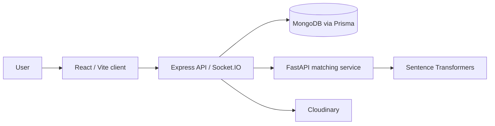

# Freelancer Portal


Freelancer Portal is a web-based project management platform that connects project requirements with suitable freelance profiles. It brings project, profile, proposal, mission, contract, and user communication workflows together in one application.

## Features

- Role-based workspaces and dashboards for administrators and freelancers.
- Freelancer profile management, including skills, experience, availability, and ratings.
- Project creation and tracking, proposal submissions, and freelancer selection.
- AI-assisted matching based on skills, semantic similarity, budget, experience, and rating.
- Mission, contract, milestone, and related document tracking.
- Real-time messaging and notifications.
- Profile image uploads through Cloudinary.

## Architecture



The repository contains three independent applications:

| Directory | Purpose | Main technologies |
| --- | --- | --- |
| `client/` | Web interface | React 19, Vite, Tailwind CSS |
| `server/` | REST API and real-time events | Node.js, Express 5, Socket.IO, Prisma |
| `ia-matching/` | Project-to-freelancer matching | Python, FastAPI, Sentence Transformers, PyTorch |

## Prerequisites

- Node.js 18 or later and npm.
- Python 3.10 or later.
- Access to a MongoDB database (local or MongoDB Atlas).
- A Cloudinary account if image uploads are needed.

## Installation and Setup

Clone the repository, then install the dependencies for each application:

```bash
git clone https://github.com/Eya-arfaoui12/FreelancerPortal.git
cd FreelancerPortal

cd client
npm install

cd ../server
npm install

cd ../ia-matching
python -m venv .venv
```

Activate the Python environment, then install its dependencies:

```bash
# Windows PowerShell
.venv\Scripts\Activate.ps1

# macOS / Linux
# source .venv/bin/activate

pip install -r requirements.txt
```

### Environment Variables

Create the following `.env` files. Do not commit them:

**`server/.env`**

```env
PORT=5000
CLIENT_URL=http://localhost:5173
DATABASE_URL="mongodb+srv://<username>:<password>@<cluster>/<database>?retryWrites=true&w=majority"
JWT_SECRET=<a-long-random-secret>
PYTHON_MATCH_URL=http://localhost:8001/match
INTERNAL_SERVICE_TOKEN=<a-long-random-shared-token>
```

**`ia-matching/.env`**

```env
INTERNAL_SERVICE_TOKEN=<the-same-token-as-in-server/.env>
MAX_TOP_K=20
```

**`client/.env`**

```env
VITE_API_URL=http://localhost:5000/api
VITE_CLOUDINARY_CLOUD_NAME=<cloud-name>
VITE_CLOUDINARY_PRESET=<unsigned-upload-preset>
```

The Cloudinary variables are only required for image uploads. Replace all example secrets with strong, private values. The matching service validates the token received in the `X-Internal-Token` header.

### Initialize the Database

From `server/`, with `DATABASE_URL` configured:

```bash
npx prisma generate
npm run db:push
```

The `db:push` command synchronizes the Prisma schema with the configured MongoDB database.

### Start the Services

Start each service in a separate terminal:

```bash
# Terminal 1: API, from server/
npm run dev
```

```bash
# Terminal 2: matching service, from ia-matching/
python app.py
```

```bash
# Terminal 3: web client, from client/
npm run dev
```

The web client is available at [http://localhost:5173](http://localhost:5173), the API at [http://localhost:5000](http://localhost:5000), and the matching service's interactive documentation at [http://localhost:8001/docs](http://localhost:8001/docs).

## Available Scripts

From `client/`:

| Command | Description |
| --- | --- |
| `npm run dev` | Starts the Vite development server. |
| `npm run build` | Creates a production build. |
| `npm run preview` | Serves the production build locally. |
| `npm run lint` | Runs ESLint. |

From `server/`:

| Command | Description |
| --- | --- |
| `npm run dev` | Starts the API with nodemon. |
| `npm start` | Starts the API. |
| `npm run db:push` | Synchronizes the Prisma schema with MongoDB. |
| `npm run db:studio` | Opens Prisma Studio. |

## Matching Service

The service exposes `POST /match`, which accepts a project and a list of freelancer profiles and returns ranked matches with score breakdowns. It also exposes `GET /health` for health checks. The `paraphrase-multilingual-mpnet-base-v2` model is loaded at startup and may be downloaded on the first run, so an initial network connection and sufficient resources for PyTorch are required.
